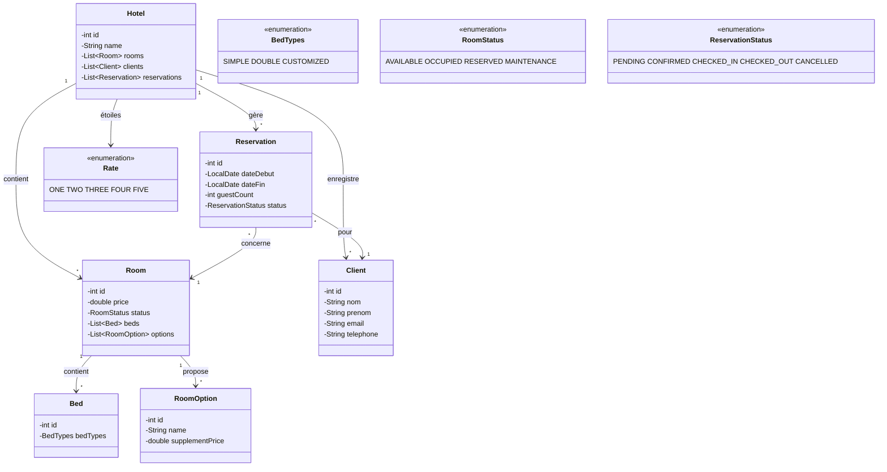

# Architecture du système hôtelier

## Vue d'ensemble

Le système modélise un hôtel et ses interactions avec :
- **Le gérant** — administration complète via la classe `Hotel`.
- **Les clients** — consultation et réservation via `Client` et `Reservation`.

---

## Diagramme des classes (relations)



---

## Responsabilités par classe

| Classe | Responsabilité principale | Acteur principal |
|--------|---------------------------|------------------|
| `Hotel` | Agrégat racine : orchestration de tout l'hôtel | Gérant |
| `Room` | Représenter une chambre et son état | Gérant + Client (consultation) |
| `Bed` | Décrire un lit et son type | Gérant |
| `RoomOption` | Options payantes (petit-déj, wifi premium, etc.) | Gérant + Client |
| `Client` | Identité et actions du client | Client |
| `Reservation` | Séjour réservé avec dates, statut, prix | Gérant + Client |
| `Rate` | Classification par étoiles | Gérant |
| `BedTypes` | Type de lit | Gérant + Client |
| `RoomStatus` | Disponibilité d'une chambre | Gérant |
| `ReservationStatus` | Cycle de vie d'une réservation | Gérant + Client |

---

## Flux métier principaux

### Flux 1 — Client réserve une chambre

```
Client.rechercherChambresDisponibles(dates)
    → Hotel.getChambresDisponibles(dateDebut, dateFin)
        → filtre Room où status = AVAILABLE et pas de conflit Reservation
Client.creerReservation(room, dates, guestCount)
    → Hotel.creerReservation(client, room, dates, guestCount)
        → new Reservation(...)
        → Room.status = RESERVED
        → Reservation.status = CONFIRMED
```

### Flux 2 — Gérant effectue le check-in

```
Hotel.checkIn(reservationId)
    → trouver Reservation par id
    → vérifier status == CONFIRMED
    → Reservation.status = CHECKED_IN
    → Room.status = OCCUPIED
```

### Flux 3 — Gérant effectue le check-out

```
Hotel.checkOut(reservationId)
    → trouver Reservation par id
    → vérifier status == CHECKED_IN
    → Reservation.status = CHECKED_OUT
    → Room.status = AVAILABLE
    → calculer facture : Reservation.calculerPrixTotal()
```

### Flux 4 — Client annule sa réservation

```
Client.annulerReservation(reservationId)
    → Hotel.annulerReservation(reservationId, clientId)
        → vérifier que la réservation appartient au client
        → Reservation.status = CANCELLED
        → Room.status = AVAILABLE (si était RESERVED)
```

---

## Règles métier importantes

1. **Une chambre ne peut pas être double-réservée** sur des dates qui se chevauchent.
2. **Le check-in** n'est possible que si la date du jour ≥ `dateDebut`.
3. **Le check-out** n'est possible que si le statut est `CHECKED_IN`.
4. **Une annulation** n'est possible que si le statut est `PENDING` ou `CONFIRMED` (pas après check-in).
5. **Le nombre de personnes** (`guestCount`) ne doit pas dépasser la capacité de la chambre (capacité = somme des places des lits).
6. **Une chambre en MAINTENANCE** ne peut pas être réservée.

---

## Structure des packages (cible)

```
src/main/java/com/hotel/
├── Hotel.java
├── Room.java
├── Bed.java
├── Client.java
├── Reservation.java
├── RoomOption.java
├── Rate.java
├── BedTypes.java
├── RoomStatus.java          ← à créer
└── ReservationStatus.java   ← à créer
```

---

## Fichiers de tests (cible)

```
src/test/java/com/hotel/
├── HotelTest.java
├── RoomTest.java
├── ClientTest.java
└── ReservationTest.java
```

Chaque membre de l'équipe écrit les tests de sa/ses classe(s) assignée(s).
